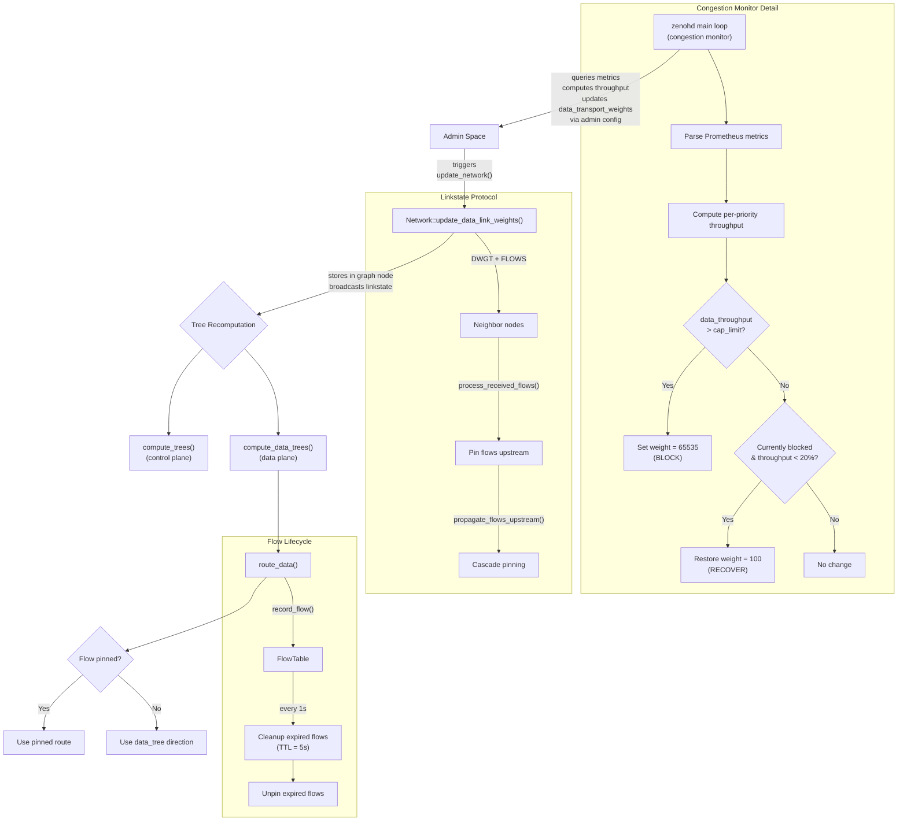

# Zenoh Modifications for Congestion-Aware QoS Routing

This document describes the modifications made to the Zenoh source code (based on v1.5.1) on the `thesis` branch. The goal is to implement a congestion-aware, priority-differentiated routing mechanism that can dynamically reroute data-priority traffic away from congested links while preserving real-time traffic routes.

## Overview

The modification introduces the following core capabilities:

1. Congestion detection via Prometheus metrics monitoring in `zenohd`
2. Dual routing trees — a separate "data tree" for data-priority traffic with independent link weights
3. Data link weight propagation through the linkstate protocol to enable distributed rerouting
4. Flow tracking and pinning to prevent route oscillation when weights change
5. Per-priority traffic statistics for fine-grained QoS decisions
6. Automatic recovery to restore default routing when congestion clears

## 1. Congestion Detection and Monitoring (`zenohd`)

Files modified:
- `zenohd/src/main.rs`
- `zenohd/Cargo.toml`

### Changes

The `zenohd` router daemon is extended with a background monitoring loop that:

- Periodically queries the admin space (`@/{zid}/router/metrics/`) for Prometheus-format transport statistics.
- Parses per-peer counters (`tx_bytes`, `rx_bytes`, `tx_n_msgs`, `rx_n_msgs`, `tx_n_dropped`, `rx_n_dropped`) and per-priority byte counters.
- Computes per-peer throughput (Mbps) and drop rate by comparing consecutive samples.
- Compares data-priority throughput against a dynamic capacity limit (`cap_limit = link_capacity - high_priority_throughput - buffer`).
- When data throughput exceeds `cap_limit`, sets the link's `data_transport_weight` to `65535` (blocked).
- When data throughput drops below 20% of `cap_limit` (recovery threshold), restores the default weight of `100`.
- Publishes weight changes to the admin config path (`@/{zid}/router/config/routing/router/linkstate/transport_weights`) to trigger runtime reconfiguration.

A new CLI argument `--cfg peer_caps:{zid1: capacity1, zid2: capacity2}` allows specifying per-peer link capacity (in Mbps) at startup.

Key constants:
- `METRICS_INTERVAL_SECS = 5` — polling interval
- `BLOCK_WEIGHT = 65535` — weight assigned to congested links
- Recovery threshold: 20% of dynamic `cap_limit`

## 2. Dual Routing Trees (Data Tree)

Files modified:
- `zenoh/src/net/protocol/network.rs`
- `commons/zenoh-config/src/lib.rs`

### Changes

A second set of routing trees (`data_trees`) is added alongside the existing `trees` in the `Network` struct. These are computed using a separate set of link weights (`data_link_weights`) that can be independently adjusted for data-priority traffic.

New fields in `Network`:
- `data_trees: Vec<Tree>` — routing trees computed from data link weights
- `data_distances: Vec<f64>` — distances computed from data link weights
- `data_link_weights: HashMap<ZenohIdProto, LinkEdgeWeight>` — per-peer data link weights

New methods:
- `compute_data_trees()` — builds a temporary graph with data-specific edge weights (using `data_link_weights`), runs Bellman-Ford shortest path for each root, and populates `data_trees` with parent/children/directions.
- `update_data_link_weights()` — updates data link weights, broadcasts to neighbors via linkstate, and returns whether recomputation is needed.

Config addition (`zenoh-config`):
- New field `data_transport_weights: Vec<TransportWeight>` under `routing.router.linkstate` and `routing.peer.linkstate`, allowing data link weights to be configured independently from control-plane link weights.

## 3. Linkstate Protocol Extension

Files modified:
- `zenoh/src/net/protocol/linkstate.rs`
- `zenoh/src/net/codec/linkstate.rs`

### Changes

The linkstate protocol message is extended with two new optional fields:

Data link weights (`DWGT` flag, bit 4):
- `data_link_weights: Option<Vec<u16>>` in `LinkState` — per-link data weights transmitted alongside regular weights.
- `data_links: HashMap<ZenohIdProto, LinkEdgeWeight>` in `LocalLinkState` / `Node` — stored per-node in the graph.

Active flows (`FLOWS` flag, bit 5):
- `active_flows: Option<Vec<FlowPin>>` in `LinkState` — list of flow pinning requests.
- `FlowPin { key_expr: String }` — identifies a flow by its key expression.

The codec (`zenoh/src/net/codec/linkstate.rs`) is updated to serialize/deserialize these new fields.

## 4. Data Link Weight Propagation

Files modified:
- `zenoh/src/net/protocol/network.rs` (in `update_data_link_weights`, `make_link_state`, `make_msg`, link state processing)
- `zenoh/src/net/routing/hat/router/mod.rs`
- `zenoh/src/net/routing/hat/linkstate_peer/mod.rs`
- `zenoh/src/net/runtime/adminspace.rs`

### Changes

When data link weights change (via admin config update):

1. Admin space trigger (`adminspace.rs`): After a successful config change, `runtime.update_network()` is called to trigger tree recomputation.
2. Broadcast (`network.rs`): `update_data_link_weights()` stores weights in `self.graph[self.idx].data_links`, increments the sequence number, and sends linkstate updates to all neighbors.
3. Reception: When a node receives a linkstate update containing `data_link_weights`, it stores them in the corresponding `Node.data_links` field.
4. Tree computation (`router/mod.rs`): After computing regular trees, `compute_data_trees()` is also called to rebuild data routing trees using the updated data link weights.
5. `make_link_state` now includes `data_link_weights` derived from `Node.data_links` when sending linkstate to neighbors.

## 5. Flow Tracking and Pinning

Files modified:
- `zenoh/src/net/protocol/network.rs`
- `zenoh/src/net/routing/dispatcher/pubsub.rs`
- `zenoh/src/net/routing/hat/mod.rs`
- `zenoh/src/net/routing/hat/router/mod.rs`
- `zenoh/src/net/routing/hat/router/pubsub.rs`

### Changes

A flow tracking system is introduced to prevent route oscillation when data link weights change.

Flow Table (`FlowTable`):
- Tracks active flows by key expression (`FlowId = String`).
- Each `FlowInfo` records: `previous_hop` (upstream), `next_hop` (downstream), `priority`, `last_update`.
- `record_flow()` is called during data routing (`route_data` in `pubsub.rs`) to record every forwarded flow.

Flow Pinning:
- `pinned_flows: HashMap<FlowId, ZenohIdProto>` — maps flow IDs to their pinned next-hop.
- When a node detects congestion and changes weights, it sends `active_flows` in its linkstate message to its upstream neighbor, requesting that the upstream node pin those flows to their current routes.
- `process_received_flows()` handles incoming flow pin requests.
- `propagate_flows_upstream()` cascades pinning requests further upstream.

Route selection override (`router/pubsub.rs`):
- `insert_faces_for_subs()` now checks `get_pinned_next_hop()` before consulting the data tree directions.
- If a flow is pinned, it uses the pinned next-hop regardless of what the data tree says.
- Self-pinning: when telling upstream to pin, the node also pins its own downstream route.

Periodic cleanup (`start_cleanup_task`):
- A background task runs every 1 second.
- Removes flows inactive for more than 5 seconds from the flow table.
- Unpins flows whose corresponding flow table entry has expired, allowing natural rerouting to resume.

HatBaseTrait extension:
- New method `record_flow()` with a default no-op implementation.
- Overridden in the router HAT to delegate to `Network.record_flow()`.

## 6. Per-Priority Traffic Statistics

Files modified:
- `io/zenoh-transport/src/common/stats.rs`
- `io/zenoh-transport/src/unicast/universal/link.rs`
- `io/zenoh-transport/src/multicast/link.rs`

### Changes

New stats struct `PriorityStats`:
- Contains 8 counters: `p0_control` through `p7_background`, one per priority level.

New fields in `TransportStats`:
- `tx_bytes_priority: PriorityStats` — per-priority TX byte counters.
- `rx_bytes_priority: PriorityStats` — per-priority RX byte counters.

Helper methods:
- `inc_tx_bytes_by_priority(priority, nb)` / `inc_rx_bytes_by_priority(priority, nb)` — increment the correct priority counter based on priority level (0-7).

TX task updates:
- In both unicast (`unicast/universal/link.rs`) and multicast (`multicast/link.rs`) TX tasks, `inc_tx_bytes_by_priority()` is called alongside `inc_tx_bytes()` when sending batches.

These per-priority stats are exposed via the Prometheus metrics endpoint and parsed by the congestion monitor in `zenohd` to distinguish high-priority vs data traffic.

## 7. Example Modifications

Files modified:
- `examples/examples/z_pub.rs`
- `examples/examples/z_sub.rs`

### Changes

Publisher (`z_pub.rs`):
- Changed to generate traffic at a target rate of 2 Mbps with 50ms intervals (instead of 1 message/second).
- Adds timestamp (`ts_ns`) to each message for latency measurement.
- Declares three publishers:
  - `publisher` on `demo/example/zenoh-rs-pub1` — data-priority traffic (active first 30 seconds).
  - `publisher_realtime` on `demo/example/zenoh-rs-pub-realtime` — `Priority::RealTime` with `CongestionControl::Block`.
  - `publisher2` on `demo/example/zenoh-rs-pub2` — data-priority traffic (activates after 30 seconds to test recovery).
- Adds a 5-second delay before starting the publish loop to allow session establishment.

Subscriber (`z_sub.rs`):
- Adds `[DATA]` or `[REALTIME]` label to received messages based on key expression.

## 8. Misc Changes

Files modified:
- `Cargo.toml` — enables `stats` feature by default for `zenoh` and `zenoh-transport` workspaces.
- `zenoh/src/net/routing/hat/p2p_peer/gossip.rs` — adds `active_flows: None` and `data_link_weights: None` to gossip `LinkState` construction.

## Congestion-Aware Routing System Architecture

